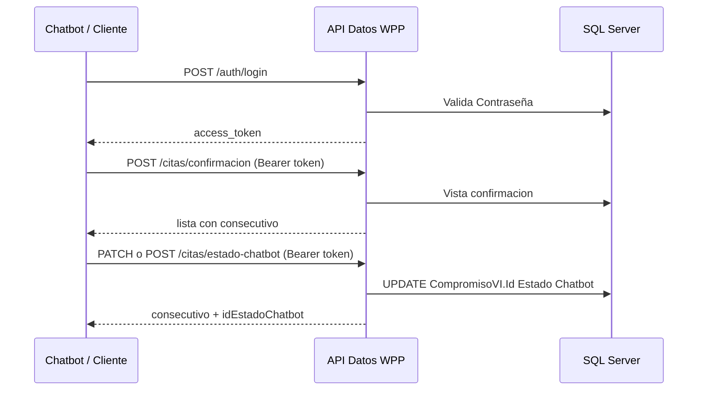

# Guia de uso - API Datos WPP

## 1) Requisitos

- Node.js 18+ recomendado
- pnpm instalado
- Acceso a SQL Server
- Columna `[Id Estado Chatbot]` creada en `CompromisoVI` (ver `sql/TABLA ESTADOS.TXT`)

## 2) Configuracion

Crear o completar el archivo `.env` en la raiz del proyecto:

```env
PORT=3000
# o BACK_PORT=3000

DB_SERVER=TU_SERVIDOR\SQLEXPRESS
DB_DATABASE=TU_BASE_DE_DATOS
DB_USER=TU_USUARIO
DB_PASSWORD=TU_PASSWORD
DB_PORT=1433
DB_ENCRYPT=false
DB_TRUST_CERT=true

JWT_SECRET=CAMBIA_ESTE_SECRETO
JWT_EXPIRES_IN=8h
```

Notas:
- El puerto se toma en este orden: `PORT`, luego `BACK_PORT`, luego `3000`.
- Para login, el usuario debe tener `Id Estado = 7` en la tabla `Contraseña`.

## 3) Arranque del proyecto

```bash
pnpm install
pnpm run start:dev
```

Base URL local:

`http://localhost:3000`

## 4) Autenticacion JWT (obligatoria)

Todas las rutas de `/citas/*` exigen token JWT. Sin token responde `401` con mensaje `Token JWT requerido.`

Rutas publicas (sin token): `GET /` y `POST /auth/login`.

### Login

**POST** `/auth/login`

Body JSON:

```json
{
  "username": "USUARIO_SQL",
  "password": "CLAVE_SQL"
}
```

Respuesta esperada:

```json
{
  "access_token": "jwt...",
  "user": {
    "sub": 123,
    "username": "USUARIO_SQL",
    "documentoEntidad": "....",
    "idNivel": 1,
    "idEstado": 7
  }
}
```

Guarda `access_token` y usalo en el header:

`Authorization: Bearer <access_token>`

## 5) Flujo completo: citas y actualizar estado



1. Hacer login y obtener `access_token`.
2. Consultar citas (`confirmacion` o `cancelacion`) con el token.
3. Tomar el campo `consecutivo` de la respuesta (es `[Id CompromisoVI]` en `CompromisoVI`).
4. Llamar `estado-chatbot` con ese `consecutivo` y el `estado` deseado.

Importante:
- `consecutivo` **no** es telefono ni documento: es el valor de `[Id CompromisoVI]`.
- Despues de marcar `confirmada` o `cancelada`, la cita deja de salir en las vistas (filtran `Id Estado Chatbot = 1` pendiente).

## 6) Recursos de citas

Header obligatorio en todos los endpoints de esta seccion:

`Authorization: Bearer <access_token>`

### Confirmacion de citas

**POST** `/citas/confirmacion`

Body JSON (opcional):

```json
{
  "fechaIni": "2026-04-01",
  "fechaFin": "2026-04-30"
}
```

Respuesta esperada:

```json
[
  {
    "phone": "573001112233",
    "contacname": "NOMBRE PACIENTE",
    "consecutivo": 12345,
    "appointment_date": "2026-04-25 14:30",
    "vlrcopago": 0,
    "responsible_name": "NOMBRE PACIENTE",
    "specialty_name": "Odontologia",
    "address": "Direccion del paciente",
    "send_type": "w"
  }
]
```

### Cancelacion de citas

**POST** `/citas/cancelacion`

Body JSON (opcional):

```json
{
  "fechaIni": "2026-04-01",
  "fechaFin": "2026-04-30"
}
```

### Actualizar estado chatbot de una cita

**PATCH** o **POST** `/citas/estado-chatbot`

Actualiza `[Id Estado Chatbot]` en `dbo.CompromisoVI` donde `[Id CompromisoVI] = consecutivo`.

Body JSON:

```json
{
  "consecutivo": 12345,
  "estado": "confirmada"
}
```

| estado       | Id Estado Chatbot | Descripcion en BD |
| ------------ | ----------------- | ----------------- |
| `pendiente`  | 1                 | Pendiente         |
| `confirmada` | 2                 | Confirmada        |
| `cancelada`  | 3                 | Cancelada         |

Respuesta esperada:

```json
{
  "consecutivo": 12345,
  "estado": "confirmada",
  "idEstadoChatbot": 2
}
```

Errores:

| Codigo | Causa |
| ------ | ----- |
| `401` | Falta header `Authorization: Bearer ...` o token invalido/expirado |
| `400` | `estado` invalido, body incompleto o `consecutivo` no es numero |
| `404` | No existe `[Id CompromisoVI]` con ese `consecutivo` |
| `500` | Error SQL (ej. columna `[Id Estado Chatbot]` no existe en la tabla) |

Ejemplo completo (PowerShell):

```powershell
# 1) Login
$login = Invoke-RestMethod -Uri "http://localhost:3000/auth/login" -Method POST `
  -ContentType "application/json" `
  -Body '{"username":"USUARIO","password":"CLAVE"}'
$token = $login.access_token

# 2) Actualizar estado
$headers = @{ Authorization = "Bearer $token" }
Invoke-RestMethod -Uri "http://localhost:3000/citas/estado-chatbot" -Method PATCH `
  -Headers $headers -ContentType "application/json" `
  -Body '{"consecutivo":12345,"estado":"confirmada"}'
```

Ejemplo (cURL):

```bash
# Login
curl --location "http://localhost:3000/auth/login" \
  --header "Content-Type: application/json" \
  --data "{\"username\":\"USUARIO\",\"password\":\"CLAVE\"}"

# Actualizar estado (reemplaza TU_TOKEN y el consecutivo real)
curl --location --request PATCH "http://localhost:3000/citas/estado-chatbot" \
  --header "Authorization: Bearer TU_TOKEN" \
  --header "Content-Type: application/json" \
  --data "{\"consecutivo\":12345,\"estado\":\"confirmada\"}"
```

## 7) Filtros por fecha

Ambos endpoints (`confirmacion` y `cancelacion`) aceptan filtros opcionales en el body JSON:

- `fechaIni` (YYYY-MM-DD)
- `fechaFin` (YYYY-MM-DD)

Reglas:
- Si no envias filtros, retorna todos los registros de la vista.
- Si envias fechas, el filtro aplica sobre `appointment_date`.
- `appointment_date` siempre se entrega con formato fijo `YYYY-MM-DD HH:mm`.
- La respuesta de citas siempre incluye solo estas columnas: `phone`, `contacname`, `consecutivo`, `appointment_date`, `vlrcopago`, `responsible_name`, `specialty_name`, `address`, `send_type`.
- Si el formato no es `YYYY-MM-DD`, retorna `400 Bad Request`.

## 8) Modelo de datos (referencia)

Tabla principal: `dbo.CompromisoVI`

| Campo API      | Columna SQL           | Uso |
| -------------- | --------------------- | --- |
| `consecutivo`  | `[Id CompromisoVI]`   | Identificador de la cita para actualizar estado |
| (actualizacion)| `[Id Estado Chatbot]` | 1 pendiente, 2 confirmada, 3 cancelada |

Catalogo: `[dbo].[Estado Chatbot]` (ver `sql/TABLA ESTADOS.TXT`).

Vistas:
- `[dbo].[Cnsta Confirmación de Citas]` — citas con `[Id Estado] = 58` y chatbot pendiente
- `[dbo].[Cnsta Cancelacion de Citas]` — citas con `[Id Estado] IN (60, 61)` y chatbot pendiente

SQL de actualizacion ejecutado por la API:

```sql
UPDATE dbo.CompromisoVI
SET [Id Estado Chatbot] = @idEstadoChatbot
OUTPUT INSERTED.[Id CompromisoVI], INSERTED.[Id Estado Chatbot]
WHERE [Id CompromisoVI] = @consecutivo
```

## 9) Solucion de problemas

- **401 Token JWT requerido**: primero llama `/auth/login` y envia `Authorization: Bearer <access_token>`.
- **404 No se encontro la cita**: el `consecutivo` debe ser exactamente el `consecutivo` devuelto por confirmacion/cancelacion (es `[Id CompromisoVI]`).
- **400 estado debe ser pendiente, confirmada o cancelada**: usa minusculas exactas en `estado`.
- **La cita ya no aparece en confirmacion**: si ya la marcaste `confirmada` o `cancelada`, su `[Id Estado Chatbot]` dejo de ser `1` y las vistas ya no la listan (comportamiento esperado).
- **500 al actualizar**: ejecuta el script de `sql/TABLA ESTADOS.TXT` para crear la columna y la tabla de estados.
